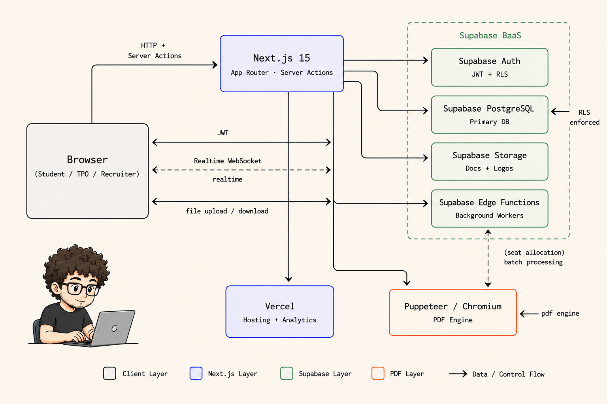

<div align="center">

#  PlacePro

<code>campus recruitment. simplified.</code>

<br>

<code>status → proposed to tpo</code> &nbsp;
<code>stack → next.js 15 · supabase · vercel</code> &nbsp;
<code>students → 200+ targeted</code>

<br>

[www.placepro.in](https://www.placepro.in)

</div>

---

## What Is This

PlacePro replaces the generic placement portals most 
colleges use. One platform for students, TPOs, and 
recruiters — applications, documents, analytics, and 
seat allocation in one place.

↳ **differentiator:** Seat Allocation Engine — parses 
student data, maps to labs, generates physical seat 
documents automatically. No other placement portal 
does this.

---

## Architecture



---

## Tech Stack

```
frontend  → Next.js 15 · React 19 · Tailwind · Radix UI
backend   → Next.js Server Actions · Supabase Edge Functions
database  → Supabase PostgreSQL · RLS · Realtime WebSockets
auth      → Supabase Auth · JWT · Row Level Security
pdf       → Puppeteer + Chromium (serverless)
infra     → Vercel · Vercel Analytics
```

---

## Getting Started

```bash
➜ git clone https://github.com/pranavgawaii/placepro
➜ cd placepro
➜ cp .env.example .env.local   # add supabase keys
➜ npm install && npm run dev
```

---

## Key Features

→ seat allocation engine — lab mapping + auto document generation  
→ realtime updates via supabase websockets  
→ role-based access — student · tpo · recruiter  
→ automated pdf generation — resumes + seat docs  
→ live analytics — placement % · packages · branch-wise offers  
→ bulk student registry upload  

---

## What's Next

→ placepro ai — llm-powered resume evaluation  
→ blockchain verified institutional credentials  
→ multi-college cluster support  

---

<div align="center">
<br>
<code>www.placepro.in</code> &nbsp;•&nbsp; <code>www.pranavx.in</code>
<br><br>
</div>
