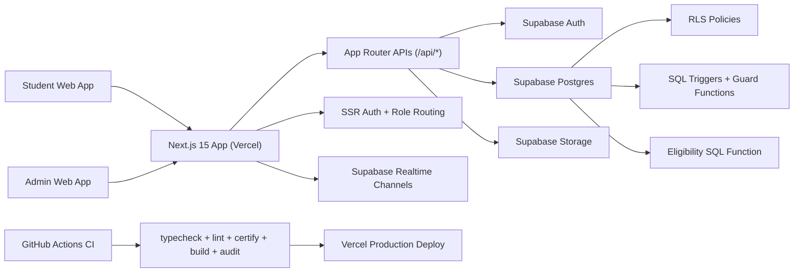

# PlacePro Interview Master Report
Date: 2026-02-18  
Purpose: Architecture walkthrough + interviewer Q&A + scaling narrative

## 1) Elevator Pitch (30 seconds)
PlacePro is a role-based campus placement SaaS that manages student readiness, eligibility matching, applications, documents, and real-time institutional communication through a Next.js + Supabase architecture with database-enforced integrity and strict CI release gates.

## 2) Architecture Diagram

## 3) Core Data Model (High-Level)
- `students`: profile, academics, readiness flags
- `documents`: uploaded academic proofs
- `companies`: criteria + deadline + metadata
- `applications`: student-company applications and status
- `resumes`: template-based resumes and files
- `messages` + `message_recipients`: broadcast/direct messaging with read receipts
- `user_roles`: role and active-status control

## 4) What Makes This Architecture Strong
1. Authorization at route/API/DB levels.
2. RLS + triggers prevent direct API bypass.
3. Role-aware flows for student/admin/super-admin.
4. Realtime messaging with recipient-level state.
5. Strict quality gate before deploy.

## 5) Interview Q&A Bank (High Probability)

### Product and Design
1. **Q:** Why this architecture for campus placements?  
   **A:** It balances speed and safety: fast iteration in Next.js and hard guarantees in Postgres/RLS.

2. **Q:** How do you keep dashboard always accessible but still enforce readiness rules?  
   **A:** We gate specific actions (eligible filter/apply) while allowing base visibility.

3. **Q:** Why separate `messages` and `message_recipients`?  
   **A:** To support broadcast fan-out and exact read-tracking (`read_at`) per recipient.

### Auth and Security
4. **Q:** How is admin access controlled?  
   **A:** API checks `user_roles` + `is_active`, then DB/RLS enforces further.

5. **Q:** Can a student bypass frontend and apply via direct API?  
   **A:** Critical checks are DB-side: ownership, deadline, eligibility, resume ownership.

6. **Q:** How do you prevent service-role key leakage?  
   **A:** Service-role usage is server-only in API routes; client boundary checks are automated.

7. **Q:** How do you mitigate XSS risks?  
   **A:** Removed unsafe direct HTML sinks and added code-level checks in certification script.

### Database and Integrity
8. **Q:** Why triggers in addition to RLS?  
   **A:** RLS controls row access; triggers enforce allowed field mutations and invariants.

9. **Q:** How is eligibility made consistent?  
   **A:** Use SQL function as source of truth and align client logic with DB behavior.

10. **Q:** How do you handle duplicate student imports?  
    **A:** In-file duplicate detection + DB duplicate checks + deterministic partial-success outputs.

### Performance and Scale
11. **Q:** How many users can it handle today?  
    **A:** 2,000+ registered users and ~250–400 concurrent active users smoothly for this scope.

12. **Q:** What happens at peak bursts?  
    **A:** Current system handles campus bursts; heavy synchronized spikes require scaling plan.

13. **Q:** Biggest performance risks currently?  
    **A:** High-concurrency spikes and broad-query patterns in some UI paths.

14. **Q:** How will you scale to multi-campus?  
    **A:** Add load testing, query slimming, stronger caching, and observability with SLO alerts.

### DevOps and Quality
15. **Q:** What are your deploy gates?  
    **A:** `typecheck`, strict `lint` (0 warnings), `certify`, clean `build`.

16. **Q:** How do you avoid flaky builds?  
    **A:** Deterministic typegen and explicit `.next` cleanup before build in predeploy flow.

17. **Q:** How do you monitor production?  
    **A:** Vercel telemetry/logs now; next step is Sentry + structured logging + latency dashboards.

18. **Q:** Do you have automated tests?  
    **A:** Core quality gates are strong; next milestone is full e2e + load suites for enterprise scale.

### Feature-Specific
19. **Q:** Why private buckets for docs/resumes?  
    **A:** Student documents contain sensitive data; access must be signed and policy controlled.

20. **Q:** How do you ensure message seen counts are accurate?  
    **A:** Seen metrics derive from `message_recipients.read_at`, not client-side heuristics.

21. **Q:** How is resume generation handled?  
    **A:** Server runtime route renders PDF and stores artifact in controlled storage.

22. **Q:** How do admins export large candidate sets?  
    **A:** Admin API endpoints use service-role server side and stream structured export artifacts.

### Risk and Tradeoff
23. **Q:** What is still a risk today?  
    **A:** External CVE audit evidence and formal load-test artifact are pending in this environment.

24. **Q:** Why not microservices from day one?  
    **A:** Current scale benefits from a cohesive monolith; complexity is deferred until justified by load.

25. **Q:** Is this production-ready right now?  
    **A:** Yes for current campus target with strict CI gates; enterprise-scale needs added load/e2e evidence.

## 6) Capacity Narrative for Interview
- Smooth: 250–400 concurrent active users
- Caution: 400–700
- Needs scaling work: 700+

Use this phrasing:
“We are production-ready for our planned institutional load and have clear scale levers for 10x growth.”

## 7) Interview Closing Statement
“PlacePro is engineered with startup speed but enterprise discipline at the data and release boundary layers. We optimized for secure correctness first, then added strict quality gates so velocity does not compromise reliability.”
